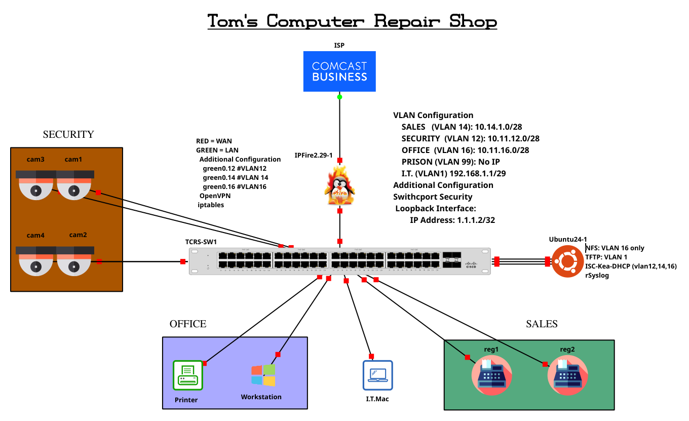

# Tom's Computer Repair Shop (TCRShop)

Welcome to the official repository of **Tom's Computer Repair Shop (TCRShop)**. This project is designed to demonstrate skills in network design and system administration. The setup includes a comprehensive network infrastructure for a small business environment. ***Note:*** Although IPFire is an exceptional stateful firewall, it is not one I would recommend. There are some advanced VLAN techniques I had to use to meet the customer's request. As a rule, IPFire doesn't have a straightforward way of configuring VLANs through the web UI; however, I've managed a workaround using iptables.

## Project Overview

This project simulates the network and server infrastructure for a small computer repair shop. The network will consist of an IPFire firewall router, Cisco IOS multilayer switch, office devices, security devices, and a Point of Sale (POS) system. Additionally, an on-site server will be deployed to handle various services.



## Network Components

- **IPFire Firewall Router**: Provides network security and management.
- **Cisco IOS Multilayer Switch**: Manages network traffic and VLANs.
- **Office Devices**: Workstations, printers, and other peripherals.
- **Security Devices**: Cameras and NVR (Network Video Recorder).
- **POS System**: For handling transactions.

## Server Components Highlights

- **Log Server**: Centralized logging for all network devices.
- **SSH Server**: Secure remote access to the network.
- **NVR**: Network Video Recorder for security cameras.
- **NFS**: Network File System for file sharing.

## Tools and Technologies Highlights 

- **Git**: Version control and project collaboration.
- **iptables**: Firewall configuration and management.
- **VLANs**: Virtual LANs for network segmentation.
- **NFS**: Network File System for file sharing.
- **Syslog**: Centralized logging.

## Getting Started

### Prerequisites

- Basic understanding of network concepts.
- Familiarity with Linux administration.
- Access to Cisco IOS devices or simulation tools.
- A system to run IPFire (physical or virtual).

### Installation and Configuration

1. **Clone the Repository**:
    ```bash
    git clone https://github.com/yourusername/tcrshop.git
    cd tcrshop
    ```

2. **Set Up IPFire Firewall**:
    - Navigate to the `firewall/ipfire-config` directory.
    - Follow the configuration guide to set up the firewall.

3. **Configure Cisco IOS Switch**:
    - Navigate to the `switch/cisco-ios-config` directory.
    - Apply the configurations to your Cisco switch.

4. **Set Up Server Services**:
    - Navigate to the `server` directory.
    - Follow the individual service setup guides for the log server, SSH server, NVR, and NFS.

## Contributing

Contributions are welcome! Please fork the repository and create a pull request with your changes. Ensure that your contributions align with the project goals and follow the established structure.

## License

This project is licensed under the MIT License - see the [LICENSE](LICENSE) file for details.

## Contact

For any inquiries or feedback, feel free to reach out:

- **Sam**: [samueljamesinc@snsnetworksolutions.net](mailto:samueljamesinc@SamuelSJames)

---

Thank you for visiting the TCRShop repository. I hope this project provides valuable insights into network design and Linux orchestration for small businesses.
